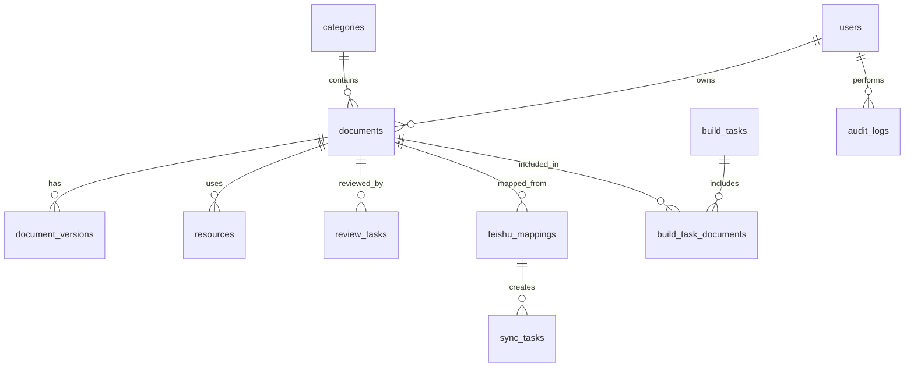

# 帮助中心运营 Agent 工作台数据模型与 API 草案

更新日期：2026-07-10  
建议新目录：`help-center-admin`  
建议后端：NestJS  
建议数据库：正式环境 PostgreSQL，本地原型可先 SQLite

## 1. 设计原则

- 数据库记录运营状态，Docusaurus 文件仍是最终静态站点生成来源。
- 所有写入 `docs`、`i18n`、`static` 的动作必须有任务日志。
- 所有 AI 生成内容第一版均为草稿，不能绕过人工审核。
- 所有飞书同步都必须保留映射关系，避免重复导入和误覆盖。
- 所有正式 build 包必须能追溯到文档版本、操作者、构建日志和变更清单。

## 2. 核心实体关系



## 3. 数据表草案

### 3.1 users

用途：保存飞书用户和系统角色。

| 字段 | 类型 | 说明 |
| --- | --- | --- |
| id | uuid | 系统用户 ID |
| feishu_open_id | string | 飞书 open_id |
| feishu_union_id | string | 飞书 union_id，可选 |
| name | string | 姓名 |
| email | string | 邮箱 |
| department | string | 部门 |
| avatar_url | string | 头像 |
| role | enum | operator, reviewer, admin |
| status | enum | active, disabled |
| last_login_at | datetime | 最近登录时间 |
| created_at | datetime | 创建时间 |
| updated_at | datetime | 更新时间 |

### 3.2 categories

用途：管理 Docusaurus 目录。

| 字段 | 类型 | 说明 |
| --- | --- | --- |
| id | uuid | 目录 ID |
| parent_id | uuid | 父目录，一级目录为空 |
| level | number | 1 或 2 |
| name_zh | string | 中文目录名 |
| name_en | string | 英文目录名 |
| slug | string | URL/path 片段 |
| docusaurus_path | string | 对应文件目录 |
| sidebar_position | number | 排序 |
| enabled | boolean | 是否启用 |
| created_at | datetime | 创建时间 |
| updated_at | datetime | 更新时间 |

约束：

- 同级目录 slug 不可重复。
- 存在文档引用时不能硬删除。

### 3.3 documents

用途：保存文档主记录。

| 字段 | 类型 | 说明 |
| --- | --- | --- |
| id | uuid | 文档 ID |
| title | string | 标题 |
| sidebar_label | string | 侧边栏标题 |
| summary | text | 摘要 |
| language | enum | zh-Hans, en |
| category_id | uuid | 所属二级目录，必要时可指向一级目录 |
| slug | string | 文档 slug |
| route_path | string | Docusaurus 路由 |
| official_url | string | 正式域名 URL |
| source_file_path | string | 本地 MDX 源文件 |
| status | enum | draft, review, rejected, approved, pending_publish, packaged, online, archived |
| content_status | enum | empty, ready, conversion_failed, needs_manual |
| translation_status | enum | none, source, draft_generated, needs_review, reviewed, outdated |
| zh_doc_id | uuid | 中文关联文档 |
| en_doc_id | uuid | 英文关联文档 |
| source_type | enum | docusaurus, feishu_doc, feishu_wiki, manual |
| source_url | text | 来源链接 |
| owner_id | uuid | 负责人 |
| last_editor_id | uuid | 最近编辑人 |
| last_reviewed_by | uuid | 最近审核人 |
| reviewed_at | datetime | 审核时间 |
| created_at | datetime | 创建时间 |
| updated_at | datetime | 更新时间 |

约束：

- `language + route_path` 不可重复。
- 待发布文档必须有关联版本记录。

### 3.4 document_versions

用途：保存文档版本和差异追踪。

| 字段 | 类型 | 说明 |
| --- | --- | --- |
| id | uuid | 版本 ID |
| document_id | uuid | 文档 ID |
| version_no | number | 版本号 |
| title | string | 当时标题 |
| front_matter | json | front matter |
| mdx_content | text | MDX 正文 |
| change_summary | text | 变更说明 |
| created_by | uuid | 创建人 |
| created_at | datetime | 创建时间 |

### 3.5 resources

用途：保存图片和附件。

| 字段 | 类型 | 说明 |
| --- | --- | --- |
| id | uuid | 资源 ID |
| document_id | uuid | 所属文档 |
| type | enum | image, attachment |
| source | enum | feishu, manual, docusaurus |
| source_token | string | 飞书资源 token |
| original_name | string | 原始文件名 |
| file_name | string | 本地文件名 |
| file_ext | string | 扩展名 |
| file_size | number | 文件大小 |
| mime_type | string | MIME 类型 |
| local_path | string | 本地路径 |
| public_url | string | 公开访问路径 |
| hash | string | 文件 hash |
| status | enum | pending, ready, missing, download_failed, unused |
| error_message | text | 异常说明 |
| created_at | datetime | 创建时间 |
| updated_at | datetime | 更新时间 |

### 3.6 feishu_mappings

用途：保存飞书文档/知识库与帮助中心文档的映射。

| 字段 | 类型 | 说明 |
| --- | --- | --- |
| id | uuid | 映射 ID |
| document_id | uuid | 帮助中心文档 |
| source_type | enum | doc, wiki |
| feishu_url | text | 飞书链接 |
| feishu_token | string | 文档或节点 token |
| feishu_title | string | 飞书标题 |
| target_language | enum | zh-Hans, en |
| sync_mode | enum | manual, scheduled |
| sync_status | enum | idle, syncing, success, failed, paused |
| last_synced_at | datetime | 最近同步时间 |
| last_error | text | 最近错误 |
| created_by | uuid | 创建人 |
| created_at | datetime | 创建时间 |
| updated_at | datetime | 更新时间 |

### 3.7 sync_tasks

用途：保存导入/同步任务。

| 字段 | 类型 | 说明 |
| --- | --- | --- |
| id | uuid | 任务 ID |
| mapping_id | uuid | 映射 ID |
| task_type | enum | import_one, sync_one, wiki_batch_import |
| status | enum | pending, running, success, failed, cancelled |
| log | text | 任务日志 |
| result_json | json | 结果 |
| error_message | text | 错误 |
| operator_id | uuid | 操作人 |
| started_at | datetime | 开始时间 |
| finished_at | datetime | 结束时间 |
| created_at | datetime | 创建时间 |

### 3.8 review_tasks

用途：保存审核记录。

| 字段 | 类型 | 说明 |
| --- | --- | --- |
| id | uuid | 审核任务 ID |
| document_id | uuid | 文档 ID |
| version_id | uuid | 文档版本 |
| status | enum | pending, approved, rejected |
| submitter_id | uuid | 提交人 |
| reviewer_id | uuid | 审核人 |
| comment | text | 审核意见 |
| submitted_at | datetime | 提交时间 |
| reviewed_at | datetime | 审核时间 |

### 3.9 build_tasks

用途：保存构建和打包记录。

| 字段 | 类型 | 说明 |
| --- | --- | --- |
| id | uuid | 构建任务 ID |
| task_name | string | 任务名称 |
| status | enum | pending, running, success, failed, cancelled |
| build_scope | enum | all, pending_publish, selected |
| build_log | text | 构建日志 |
| artifact_path | string | build.zip 本地路径 |
| artifact_url | string | 下载链接 |
| change_summary | text | 变更摘要 |
| operator_id | uuid | 操作人 |
| started_at | datetime | 开始时间 |
| finished_at | datetime | 结束时间 |
| created_at | datetime | 创建时间 |

### 3.10 notifications

用途：保存飞书通知记录。

| 字段 | 类型 | 说明 |
| --- | --- | --- |
| id | uuid | 通知 ID |
| channel | enum | feishu_group, feishu_user |
| target_id | string | chat_id 或 open_id |
| title | string | 标题 |
| content | text | 内容 |
| related_task_id | uuid | 关联 build 或 sync 任务 |
| status | enum | pending, sent, failed |
| error_message | text | 失败原因 |
| sent_at | datetime | 发送时间 |
| created_at | datetime | 创建时间 |

### 3.11 system_configs

用途：保存非敏感系统配置。

| 字段 | 类型 | 说明 |
| --- | --- | --- |
| key | string | 配置键 |
| value | text | 配置值 |
| value_type | enum | string, number, boolean, json |
| description | string | 说明 |
| updated_by | uuid | 修改人 |
| updated_at | datetime | 更新时间 |

注意：

- App Secret、Token、SSH Key 不进入此表明文保存。
- 敏感配置使用服务器环境变量或密钥管理服务。

## 4. API 草案

### 4.1 Auth

| 方法 | 路径 | 说明 |
| --- | --- | --- |
| GET | `/api/auth/feishu/login-url` | 获取飞书登录 URL |
| GET | `/api/auth/feishu/callback` | 飞书登录回调 |
| GET | `/api/auth/me` | 获取当前用户 |
| POST | `/api/auth/logout` | 退出登录 |

### 4.2 Documents

| 方法 | 路径 | 说明 |
| --- | --- | --- |
| GET | `/api/documents` | 文档列表 |
| POST | `/api/documents` | 新建文档 |
| GET | `/api/documents/:id` | 文档详情 |
| PUT | `/api/documents/:id` | 更新文档 |
| POST | `/api/documents/:id/submit-review` | 提交审核 |
| POST | `/api/documents/:id/generate-en-draft` | 生成英文草稿 |
| GET | `/api/documents/:id/versions` | 版本列表 |
| POST | `/api/documents/:id/preview` | 生成单篇预览 |

### 4.3 Categories

| 方法 | 路径 | 说明 |
| --- | --- | --- |
| GET | `/api/categories` | 目录列表 |
| POST | `/api/categories` | 新建目录 |
| PUT | `/api/categories/:id` | 更新目录 |
| DELETE | `/api/categories/:id` | 删除目录 |
| POST | `/api/categories/reorder` | 调整排序 |
| POST | `/api/categories/export-docusaurus` | 生成 `_category_.json` |

### 4.4 Feishu Import

| 方法 | 路径 | 说明 |
| --- | --- | --- |
| POST | `/api/feishu/import/doc` | 导入单篇飞书文档 |
| POST | `/api/feishu/wiki/preview-tree` | 预览知识库目录树 |
| POST | `/api/feishu/wiki/import` | 批量导入知识库 |
| GET | `/api/feishu/mappings` | 映射列表 |
| POST | `/api/feishu/mappings/:id/sync` | 同步单篇 |
| POST | `/api/feishu/mappings/batch-sync` | 批量同步 |
| GET | `/api/feishu/sync-tasks/:id` | 同步任务详情 |

### 4.5 Review

| 方法 | 路径 | 说明 |
| --- | --- | --- |
| GET | `/api/reviews` | 待审核列表 |
| POST | `/api/reviews/:id/approve` | 审核通过 |
| POST | `/api/reviews/:id/reject` | 审核驳回 |

### 4.6 Build

| 方法 | 路径 | 说明 |
| --- | --- | --- |
| POST | `/api/build/check` | 构建检查 |
| POST | `/api/build/artifact` | 生成 build.zip |
| GET | `/api/build/tasks` | 构建任务列表 |
| GET | `/api/build/tasks/:id` | 构建任务详情 |
| GET | `/api/build/tasks/:id/logs` | 构建日志 |
| GET | `/api/build/tasks/:id/download` | 下载 build.zip |
| POST | `/api/build/tasks/:id/notify-feishu` | 发送飞书通知 |

### 4.7 Agent

| 方法 | 路径 | 说明 |
| --- | --- | --- |
| POST | `/api/agent/check-document` | 质检文档 |
| POST | `/api/agent/convert-feishu-mdx` | 转换飞书内容为 MDX |
| POST | `/api/agent/generate-summary` | 生成摘要 |
| POST | `/api/agent/generate-english` | 生成英文草稿 |
| POST | `/api/agent/build-handoff-message` | 生成部署交接文案 |

## 5. 状态机草案

### 文档状态

```text
draft
  -> review
  -> rejected
  -> draft
  -> review
  -> approved
  -> pending_publish
  -> packaged
  -> online
  -> archived
```

### 资源状态

```text
pending -> ready
pending -> download_failed
ready -> missing
ready -> unused
```

### 构建任务状态

```text
pending -> running -> success
pending -> running -> failed
pending -> cancelled
```

## 6. 服务边界草案

```text
ProjectScannerService
  扫描 docs/i18n/static，初始化文档和资源数据。

DocusaurusWriterService
  将审核通过的文档写入 MDX 和 _category_.json。

MdxConverterService
  处理 Markdown/MDX/front matter/资源路径。

ResourceService
  管理图片、附件、hash、缺失检查。

BuildService
  执行资源检查、npm run build、打包 build.zip。

FeishuService
  封装飞书登录、文档、知识库、云盘、机器人消息。

AgentService
  封装 AI 生成、质检、解释、交接文案。
```

