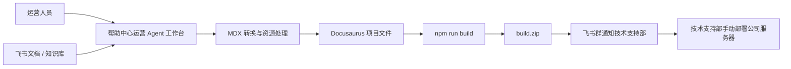

# 帮助中心运营 Agent 工作台 MVP 优先级与技术架构

更新日期：2026-07-10  
关联项目：`D:\AI_Workspace\oceanpayment-help-center`  
参考系统：`D:\AI_Workspace\oceanpayment-help-center\miaoda-app`  
当前阶段：方案补充，不进入代码实现

## 1. 本文目标

本文用于补充《帮助中心管理系统与 Agent 方案设计_2026-07-10》，重点回答当前阶段最容易影响后续实现的几个问题：

- 新管理系统是否基于当前 Docusaurus 项目增加。
- 新系统是否需要和当前帮助中心站点一起打包。
- 之前依赖飞书开放平台企业自建应用机器人抓取飞书文档的能力，后续如何复用。
- 新系统是否可以把飞书文档或知识库内容转换成当前帮助中心样式，并生成符合项目规范的 MDX 文件。
- MVP 先做哪些能力，哪些能力可以后置。
- 后续如果进入开发，推荐采用什么目录结构和技术边界。

## 2. 总体结论

建议把新系统定义为：

> 帮助中心运营 Agent 工作台

它不是简单的后台系统，也不是纯聊天式 Agent，而是一个给运营人员使用的独立管理系统，并在关键流程中嵌入 Agent 能力。

核心结论如下：

- 新系统可以放在当前仓库中统一管理，但应作为独立应用目录存在，不要混入 Docusaurus 公开站点运行时。
- 对外帮助中心部署包仍然只交付 Docusaurus `build` 产物，不应把管理系统一起打进公开帮助中心部署包。
- 管理系统可以读取、写入、构建当前 Docusaurus 项目，但它本身应单独部署、单独鉴权、单独配置飞书回调。
- 飞书能力建议复用现有企业自建应用的 App ID、App Secret、机器人、文档和知识库权限，但不要继续依赖飞书妙搭 APaaS 的运行环境。
- 新系统可以实现“飞书文档/知识库 -> 当前帮助中心样式 -> MDX 文件 -> Docusaurus build 包”的完整转换链路。
- 第一版应先保证人工可控闭环：导入、转换、编辑、审核、构建、生成 build 包、飞书通知技术支持部。

## 3. 新系统是否在当前项目基础上增加

建议：放在当前仓库中，但作为独立应用。

推荐原因：

- 当前 Docusaurus 项目已经是帮助中心最终内容落地位置，包括 `docs`、`i18n`、`static/img/help-center`、`static/files/help-center`、`docusaurus.config.js` 和构建脚本。
- 管理系统需要扫描、初始化、写入和构建这些文件，放在同一仓库有利于本地开发、版本管理和后续交接。
- 但管理系统和公开帮助中心是两个不同产品形态，不能把管理后台代码混入公开站点页面，否则会增加部署、安全和维护风险。

建议目录结构：

```text
oceanpayment-help-center/
  docs/
  i18n/
  static/
  src/
  scripts/
  notes/
  miaoda-app/                 # 旧系统参考，只读参考，不继续作为正式系统开发目录
  help-center-admin/          # 新管理系统，建议后续新建
    client/                   # 管理后台前端
    server/                   # 管理后台后端
    packages/
      help-center-core/       # 可选：Docusaurus 扫描、MDX 转换、资源检查、build 打包能力
```

如果后续项目规模继续扩大，也可以演进为标准 monorepo：

```text
apps/
  site/                       # 当前 Docusaurus 站点，后续如需迁移可放入这里
  admin/                      # 管理系统前端/后端
packages/
  help-center-core/
```

当前阶段不建议立刻大搬迁 Docusaurus 目录，避免影响已经稳定的帮助中心站点。

## 4. 是否需要把当前本地项目一起打包

需要区分两个包：

| 包类型 | 内容 | 使用对象 | 是否包含管理系统 |
| --- | --- | --- | --- |
| 帮助中心部署包 | Docusaurus `build` 目录压缩包 | 技术支持部同事部署到公司服务器 | 不包含 |
| 管理系统部署包 | 管理后台前端、后端、数据库配置、飞书回调配置 | 管理系统部署人员 | 包含 |

当前对技术支持部同事交付的包，仍然应该是帮助中心公开站点的 `build.zip`，也就是之前我们已经在做的那种部署包。

新管理系统上线后，它可以帮助运营人员自动生成这个 `build.zip`，并通过飞书群通知技术支持部同事。但这个 `build.zip` 只应该包含公开帮助中心页面，不应该包含后台管理系统代码、接口、密钥或数据库配置。

推荐交付边界：

- 公开帮助中心：静态站点，部署到 `https://support.oceanpayment.com`。
- 运营管理系统：内部系统，需要飞书登录，部署地址另行确定。
- 飞书机器人：作为管理系统的入口、通知通道和自动化执行触发器。

## 5. 飞书机器人和企业自建应用如何复用

之前妙搭版本依靠飞书开放平台企业自建应用里的机器人，抓取或下载飞书知识库、飞书云文档内容。新系统仍然建议复用这套企业自建应用能力，但要去掉妙搭 APaaS 强依赖。

保留：

- 飞书企业自建应用。
- App ID / App Secret。
- 飞书登录能力。
- 机器人发送群消息能力。
- 云文档读取权限。
- 知识库读取权限。
- 图片、附件下载权限。
- 后续可扩展的机器人事件回调能力。

替换：

- 不再依赖 `@lark-apaas/*` 的运行时认证、数据库、文件服务和用户组件。
- 不再把妙搭作为系统托管平台的强前提。
- 不直接迁移旧 `miaoda-app` 数据。
- 不照搬旧发布中心中自动部署、自动合并、GitHub Pages 发布等高风险能力。

可参考旧代码：

- `miaoda-app/server/modules/import/feishu.service.ts`
- `miaoda-app/server/modules/import/feishu-mappings.service.ts`
- `miaoda-app/server/modules/import/feishu-doc-converter.ts`
- `miaoda-app/server/modules/publish/publish.service.ts`
- `miaoda-app/server/database/schema.ts`
- `miaoda-app/client/src/pages/FeishuSync/`
- `miaoda-app/client/src/pages/PublishCenter/`
- `miaoda-app/client/src/pages/DocumentManage/`

新系统中应重新封装为独立 Feishu Service：

```text
FeishuAuthService
FeishuDocService
FeishuWikiService
FeishuDriveService
FeishuBotService
FeishuMappingService
```

## 6. 是否可以转换成当前帮助中心样式和 MDX

可以，而且这应当是新系统的核心能力之一。

推荐转换流水线：

```text
飞书文档/知识库
  -> 解析文档 token 或 wiki token
  -> 读取文档块结构
  -> 下载图片、附件和资源
  -> 转换为标准 Markdown
  -> 应用 Oceanpayment 帮助中心 MDX 规范
  -> 生成 front matter
  -> 写入 Docusaurus docs 或 i18n 目录
  -> 资源路径检查
  -> Docusaurus build 检查
  -> 生成预览和待审核记录
```

需要遵守当前帮助中心规则：

- 中文文档写入 `docs/...`。
- 英文文档写入 `i18n/en/docusaurus-plugin-content-docs/current/...`。
- 目录配置对应 `_category_.json`。
- 图片进入 `static/img/help-center/...`。
- 附件进入 `static/files/help-center/...`。
- 附件链接应继续兼容当前附件预览逻辑。
- 不生成 `/my-website/` 这类错误资源前缀。
- 保持当前 Docusaurus front matter 规则，例如 `title`、`sidebar_label`、`sidebar_position`、必要时使用 `hide_title`。
- 生成正式 URL 时应基于正式域名和项目真实路由，避免运营配置链接时出错。
- 不能破坏当前来源限制逻辑和搜索索引逻辑。

建议第一版采用“AI 辅助 + 程序规则兜底”的方式：

- 程序负责结构化解析、资源下载、路径生成、front matter 生成、表格和链接转换。
- Agent 负责摘要、标题优化、英文草稿、格式异常解释、内容质量建议。
- 最终发布前必须有人审核，尤其是英文版本、支付/账户/合规相关内容。

## 7. MDX 转换标准草案

一篇帮助中心文章最终应生成类似结构：

```mdx
---
title: Article Title
sidebar_label: Article Title
sidebar_position: 10
---

# Article Title

正文内容...

[Download attachment](/files/help-center/example.pdf)
```

中文和英文之间应保存关联关系：

```text
zhDocId
enDocId
translationStatus
sourceLanguage
sourceDocPath
targetDocPath
lastSyncedAt
lastReviewedAt
```

资源应保存可追踪信息：

```text
resourceType: image | attachment
source: feishu | manual
sourceToken
localPath
publicUrl
fileName
fileSize
hash
downloadStatus
usedByDocumentId
```

## 8. MVP 优先级

### P0：必须完成

P0 目标是让运营人员可以完成“从内容创建到 build 包交付”的最小闭环。

- 飞书登录。
- 用户身份识别和基础角色权限。
- 从当前 Docusaurus 项目初始化文档、目录、资源数据。
- 文档列表、筛选、搜索、状态管理。
- 新增和编辑文章。
- 目录管理，映射 Docusaurus `_category_.json`。
- 附件和图片上传。
- 飞书单篇文档导入。
- 飞书文档转换为 MDX。
- 中文和英文文档关联。
- 英文草稿生成入口。
- 内容格式检查。
- 资源路径检查。
- 审核状态流转。
- Docusaurus build 检查。
- build.zip 生成。
- 变更清单生成。
- 飞书群通知技术支持部同事。
- 任务日志和失败原因展示。

### P1：建议第二阶段完成

P1 目标是提高批量维护效率，减少人工排查。

- 飞书知识库批量导入。
- 飞书知识库目录映射建议。
- 已导入文档手动同步。
- 批量同步任务。
- 内容质检 Agent。
- 英文版本差异检测。
- 附件预览兼容性检查。
- 内部链接有效性检查。
- 构建失败原因转运营可读说明。
- build 包历史记录。
- 技术支持部部署确认记录。

### P2：后续增强

P2 目标是让系统更像 Agent 工作台，而不仅是管理后台。

- 飞书机器人自然语言指令。
- 定时同步。
- 版本 diff 和回滚辅助。
- 按目录或业务线分配审核人。
- 高级权限矩阵。
- Git 分支、PR、CI/CD 对接。
- 自动生成周报或上线报告。
- 批量内容质量评分。
- 多语言扩展。

## 9. 第一版不建议做的事情

这些能力容易引入风险，建议等基础闭环稳定后再考虑：

- 直接自动部署到公司服务器。
- 绕过技术支持部手动部署流程。
- AI 自动发布内容。
- AI 自动覆盖已上线内容且不经过审核。
- 在页面中明文维护 App Secret、GitHub Token、SSH Key。
- 将管理系统打进公开帮助中心静态包。
- 将旧 `miaoda-app` 作为正式系统继续二次开发。

## 10. 推荐技术架构

### 前端

建议：

- React + Vite。
- React Router。
- TanStack Query。
- 表格、筛选、弹窗、任务日志组件。
- Markdown/MDX 编辑器或 Tiptap 编辑器。

页面模块：

- 运营工作台。
- 内容管理。
- 目录设置。
- 飞书导入。
- Agent 助手。
- 审核中心。
- 发布中心。
- 系统配置。

### 后端

建议：

- NestJS。
- 模块化服务边界。
- Feishu OpenAPI SDK 或独立封装 HTTP Client。
- 文件扫描、MDX 转换、资源检查、build 执行封装为独立 service。

后端模块：

```text
AuthModule
UsersModule
DocumentsModule
CategoriesModule
ResourcesModule
FeishuModule
ImportModule
AgentModule
ReviewModule
BuildModule
NotificationModule
SystemConfigModule
AuditLogModule
```

### 数据库

正式环境建议 PostgreSQL。  
如果只是本地快速原型，可以先用 SQLite，但需要提前设计可迁移的数据模型。

核心表：

```text
users
roles
documents
document_versions
categories
resources
feishu_mappings
sync_tasks
review_tasks
build_tasks
notifications
system_configs
audit_logs
```

## 11. 和当前 Docusaurus 项目的关系

新系统不替代 Docusaurus，而是管理 Docusaurus 内容。

关系如下：



管理系统应写入这些目录：

- `docs`
- `i18n/en/docusaurus-plugin-content-docs/current`
- `static/img/help-center`
- `static/files/help-center`

管理系统应读取这些文件：

- `docusaurus.config.js`
- `sidebars.js`
- `_category_.json`
- 当前 MDX 文件 front matter
- 当前主维护版文档清单

## 12. Build 包交付方式

当前公司流程是将打包好的 build 文件通过飞书群发送给技术支持部同事，由技术支持部手动部署到公司服务器。

新系统应支持：

- 一键生成 build 包。
- 生成 build 包前检查文档、附件、图片、搜索资源、来源限制脚本。
- 生成变更清单。
- 生成部署说明。
- 生成飞书群消息文案。
- 如果文件过大，优先上传到飞书云盘或系统文件服务，再发送下载链接。

飞书通知建议包含：

```text
本次帮助中心 build 包已生成
版本时间：
变更摘要：
新增文档：
修改文档：
删除/归档文档：
附件变更：
构建检查结果：
下载链接：
部署说明：
上线后验收链接：
```

## 13. Agent 能力边界

Agent 可以做：

- 读取飞书文档内容。
- 生成 MDX 草稿。
- 生成英文草稿。
- 检查格式、链接、资源路径。
- 解释构建失败原因。
- 生成部署交接说明。
- 生成飞书通知文案。
- 汇总本次变更。

Agent 必须询问或等待人工确认：

- 是否覆盖已有人为修改的文档。
- 是否发布英文版本。
- 是否把文档提交审核。
- 是否生成正式 build 包。
- 是否通知技术支持部。

Agent 第一版不能做：

- 自动跳过审核发布。
- 自动部署公司服务器。
- 自动修改飞书开放平台敏感配置。
- 自动删除大量文档或资源。
- 自动把未经确认的 AI 英文内容作为正式上线版本。

## 14. 下一步建议

建议后续按这个顺序推进：

1. 确认本方案中的系统边界：管理系统独立部署，公开帮助中心仍只交付 Docusaurus build 包。
2. 确认新系统目录名称，建议使用 `help-center-admin`。
3. 确认第一版是否采用 PostgreSQL，或先用 SQLite 做本地原型。
4. 梳理飞书企业自建应用当前已有权限，列出缺失权限。
5. 设计数据库表和 API 草案。
6. 设计页面原型和运营人员操作流。
7. 再进入代码实现。

## 15. 当前明确回答

### 新系统是在当前项目基础上增加吗

是，建议在当前仓库中增加独立管理系统目录，但不要混入 Docusaurus 公开站点代码。

### 是把当前本地项目一起打包吗

不是。公开帮助中心交付时仍只打包 Docusaurus `build` 目录。管理系统是另一套内部系统，需要单独部署。

### 之前飞书机器人抓取文档的方式还能用吗

可以复用企业自建应用、机器人和权限，但要改成新后端直接调用飞书 OpenAPI，不再依赖妙搭 APaaS 运行时。

### 新系统能转换成当前帮助中心样式和 MDX 吗

可以，这应是核心能力。转换时需要结合程序规则和 Agent 能力，最终输出符合当前 Docusaurus 目录、front matter、资源路径、附件预览、双语结构和正式 URL 规则的 MDX 文件。

### 当前是否应该立刻写代码

建议先完成方案确认、MVP 清单、数据模型和页面原型，再开始新建 `help-center-admin`。这样更稳，也方便后续和运营、技术支持部或信息安全同事对齐。
